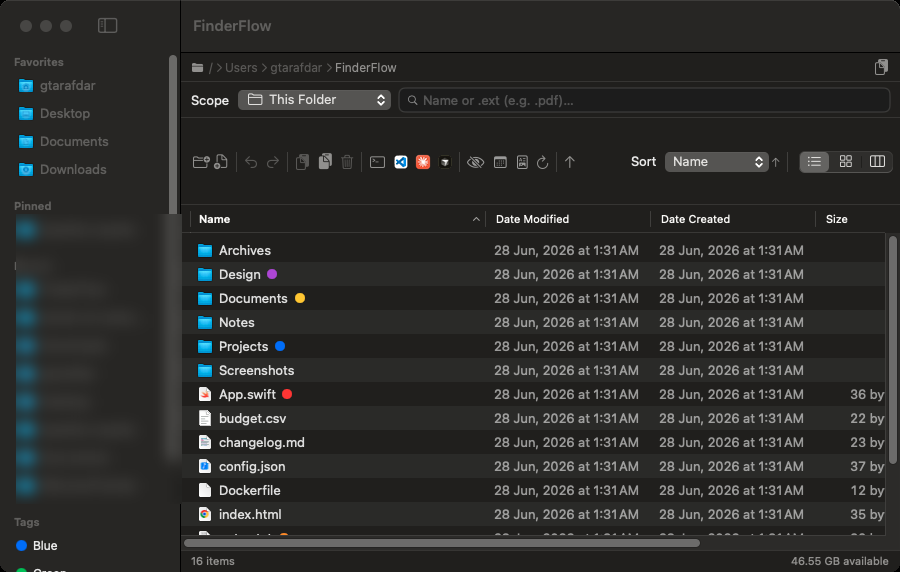
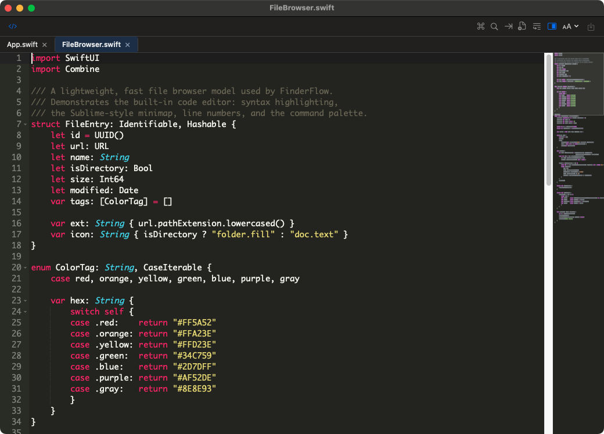
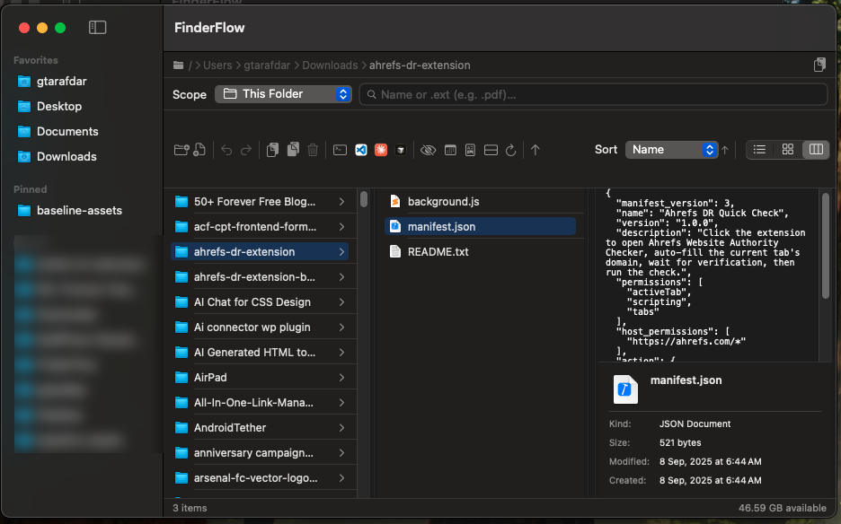
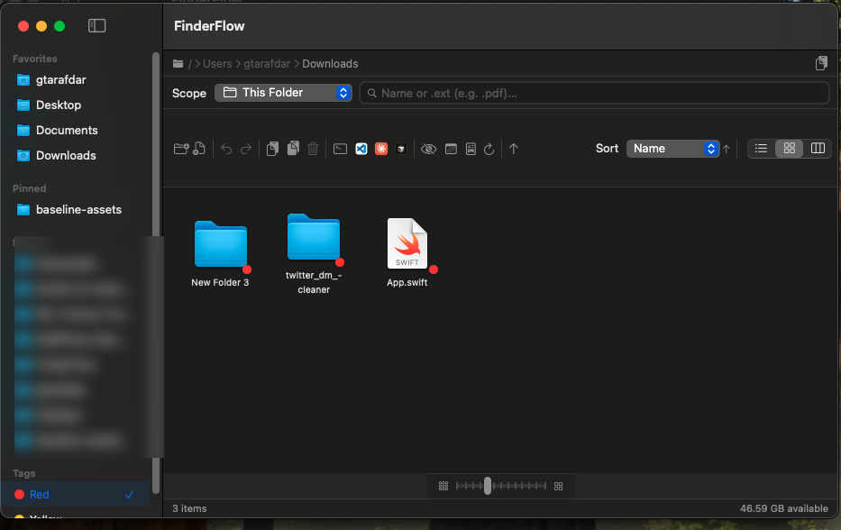
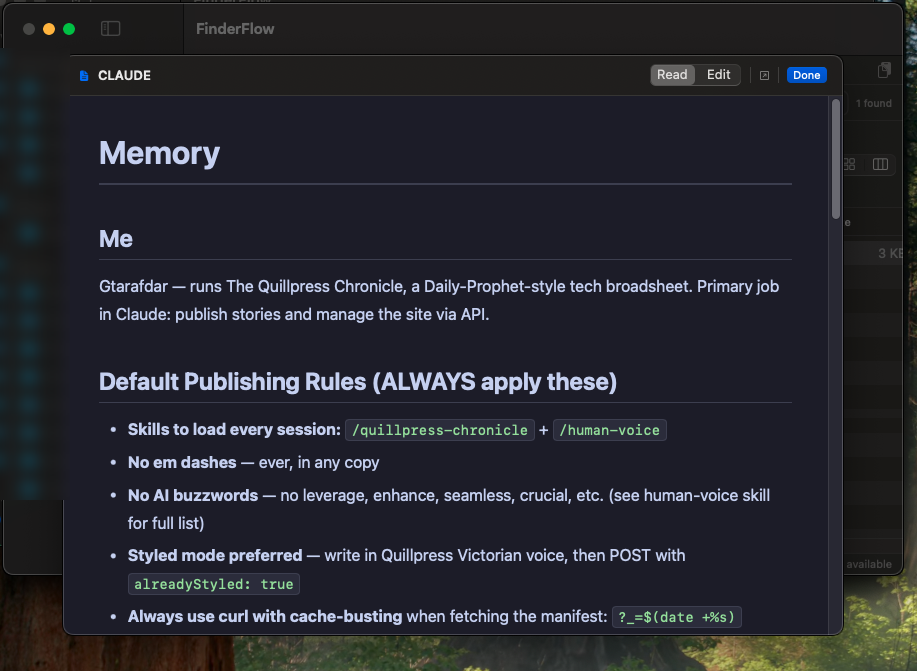
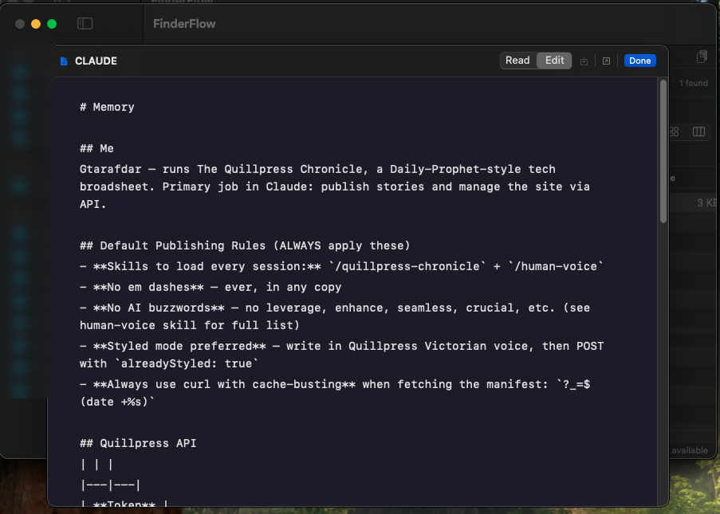

<div align="center">


# FinderFlow

**The Mac file manager Finder should have shipped.**

A fast, native macOS file browser with a built-in code editor, a Markdown
reader, real Finder-compatible color tags, Spotlight search, archive tools, and
one-click "open in Terminal / VS Code / Cursor / Claude Code / Codex" — in one
self-contained app that runs entirely on your Mac.

[](../../releases)
[](../../releases)


[](LICENSE)
[](../../stargazers)

**[⬇ Download the latest release](../../releases/latest)** ·
**[🌐 Landing page](https://gtarafdar.github.io/FinderFlow/)** ·
**[⭐ Star](../../stargazers)** ·
**[❤️ Donate](https://gtarafdar.com/donate)**

`macOS 14+` · `Apple Silicon + Intel (universal)` · `≈ 6.8 MB` · `Free & open source (MIT)`

</div>

---

## What it is

FinderFlow is a **drop-in alternative to the macOS Finder** for people who live
in their files all day — developers, writers, designers, and anyone who has ever
wished Finder did *more*. It keeps everything you like about Finder (column /
list / icon views, Quick Look, tags, the sidebar) and adds the things you
normally reach for three other apps to get.

It's **one download, fully self-contained** — no Homebrew, no Node, no runtimes,
no plugins. Everything runs locally on your Mac. There is **no telemetry, no
account, and no network calls**.

|  Browse, tag & search  |  Edit code — built in  |
| :---: | :---: |
|  |  |
| Color tags, Spotlight search, sortable columns, copy-path | Tabs, syntax highlighting, command palette, Sublime-style minimap |
|  Column view + preview  |  Icon view + color tags  |
|  |  |
| Finder-style miller columns with a live preview & Get Info pane | Resizable icon grid; tap a tag to filter Mac-wide |
|  Markdown — read mode  |  Markdown — edit mode  |
|  |  |
| Rendered preview (no Obsidian needed) | Edit & save with ⌘S, auto-save on close |

> 🌐 **[See the interactive showcase on the landing page →](https://gtarafdar.github.io/FinderFlow/#showcase)**

---

## Why you'll want it — things macOS Finder can't do

These are the headline reasons people switch. **None of them ship in Finder.**

- **📝 A real code editor, built in.** Double-click any text or code file and it
  opens in a proper editor — tabs, syntax highlighting for dozens of languages, a
  fuzzy **command palette (⌘⇧P)**, Sublime keybindings, and a **Sublime-style
  minimap**. You don't need to install Sublime Text or VS Code just to make a
  quick edit.
- **📖 A Markdown reader *and* editor.** Open `.md` files into a clean rendered
  view (great for AI-generated / README / notes files) — or flip to edit mode and
  save with ⌘S. **No Obsidian or separate Markdown app required.**
- **👀 Real preview for popular file types.** Built on the same Quick Look engine
  Finder uses — images, PDFs, code, video, audio, docs — right inside the column
  preview pane and with the Space bar.
- **🖱️ UI-driven file operations.** Cut, copy, paste, **move**, duplicate,
  rename, make alias, compress, extract — all from buttons and right-click menus,
  with full **undo/redo**. No memorizing Terminal commands.
- **🧑‍💻 One-click IDE & terminal launch.** Open the current folder in **Terminal,
  VS Code, Cursor, Claude Code, or Codex** — buttons appear only for the tools you
  actually have installed.
- **🔎 Search that actually finds things.** This folder, this folder + subfolders,
  or **Spotlight-powered across your whole Mac** — including extension search
  (type `.pdf`) — without leaving the window.
- **🔗 Copy a folder's path in one click.** A dedicated copy-path button with a
  confirmation toast. (Try doing *that* quickly in Finder.)
- **🗜️ Archive tools that just work.** Compress to `.zip`; extract
  `.zip / .tar / .gz / .tgz / .bz2 / .xz` using macOS's built-in tools.

> If you've ever opened Finder, then Sublime, then Obsidian, then Terminal just
> to deal with one folder — FinderFlow is that whole stack in a single window.

---

## Everything it does

<details open>
<summary><b>Browsing & navigation</b></summary>

- **Three views** — **Column** (Finder-style miller columns with a live preview
  pane + optional ancestor "tree" mode), **List** (sortable by Name, Date
  Modified, Date Created, Size, Kind, Extension, with optional *Group by Date*),
  and **Icon** (resizable 32–128 pt grid).
- **Sidebar** — system locations, your **pinned** folders, **recent** folders,
  and a **Tags** section.
- **Path bar** — clickable breadcrumbs, double-click to type a path, one-click
  **Copy Path**.
- **Status bar** — item count, selection size, free disk space.
- **Quick Look** (Space) + a built-in preview panel.
</details>

<details>
<summary><b>Finder-compatible color tags</b></summary>

- Add/remove the 7 standard macOS colors from any view's right-click **Tags**
  menu — toggles exactly like Finder, multiple colors per file preserved.
- Written in macOS's real tag format, so they **also show up in Finder**.
- Tag dots render in list / icon / column / preview; tapping a tag in the sidebar
  filters **Mac-wide** via Spotlight.
</details>

<details>
<summary><b>File operations (with Undo/Redo)</b></summary>

- Copy / Cut / Paste, Duplicate, inline Rename, Make Alias (symlink).
- Move to Trash and **Delete Permanently** (confirmed).
- **Compress** to `.zip`; **Extract** common archive formats.
- Share / AirDrop, Show in Finder, Get Info, Copy Path.
- Multi-select aware; partial-failure-safe paste/move with correct undo.
</details>

<details>
<summary><b>Built-in code editor (bundled & offline)</b></summary>

- Double-click a text/code file to edit it in FinderFlow.
- Syntax highlighting for dozens of languages; **multiple files as tabs**.
- **Fuzzy command palette (⌘⇧P)**, settings menu, Sublime keybindings.
- **Sublime-style minimap** (theme-aware, click/drag to scroll).
- Runs in a **real, standalone macOS window** — drag, minimize, resize, fit —
  and never blocks the main browser window.
</details>

<details>
<summary><b>Markdown reader / editor</b></summary>

- Rendered preview (GitHub/Obsidian-style, dark + light) with internal `.md`
  link navigation, plus an **Edit** mode with ⌘S save and auto-save on close.
</details>

<details>
<summary><b>Search</b></summary>

- Scopes: This Folder, This Folder & Subfolders, Desktop, Documents, Downloads,
  Home, and **Entire Mac** (Spotlight).
- Name and **extension** search; live count; runs in the background.
</details>

<details>
<summary><b>System integration</b></summary>

- **Finder Sync extension** — right-click in Finder: New Folder Here, Copy Path,
  Open in Terminal, **Open in FinderFlow**.
- **Set FinderFlow as your default folder handler** (Settings) — routes folder
  opens to FinderFlow via LaunchServices.
- `finderflow://` URL scheme + "Open With" for folders & text files.
- **Launch at Login** toggle, in-app toast notifications.
</details>

---

## Security & privacy

FinderFlow touches your files, so it's built to earn that trust — and it was put
through a **senior-QA and security pass** before release.

- **100% local. No network, no telemetry, no accounts.** FinderFlow makes no
  outbound connections of its own. Nothing about your files ever leaves your Mac.
- **Security-reviewed.** An **AppleScript-injection** path (via crafted
  filenames in *Get Info* / *Open in Terminal*) was found and fixed with strict
  string-literal escaping, and the same hardening was applied to the Finder
  extension. The shell/AppleScript bridges were audited end-to-end.
- **Bug-hardened.** The QA pass also fixed a dead keyboard command, unsaved
  Markdown data-loss on close, and made partial paste/move failures undo-safe —
  so you don't lose work.
- **Sandboxed where it matters.** The Finder extension runs **sandboxed**; the
  main app is not sandboxed because a file manager needs full file-system access
  (the same reason Finder isn't). It only uses the access *you* grant via standard
  macOS prompts.
- **Open source.** Read every line. MIT licensed.

## Light on RAM — a file manager, not a memory hog

A file manager should disappear into the background, not sit in Activity Monitor
eating your RAM:

- **≈ 55–60 MB idle** while browsing — measured, not guessed.
- File-type icons are **cached, not duplicated**, so big folders stay lean.
- The code editor and Markdown preview use embedded web tech (WebKit) **only
  while open**, and that memory is **released the moment you close the window**.
- Event-driven — it isn't polling the disk or burning CPU in the background.

---

## Requirements

| **macOS**    | 14.0 Sonoma or later                       |
| ------------ | ------------------------------------------ |
| **Chip**     | Apple Silicon or Intel (universal binary)  |
| **Download** | ≈ 6.8 MB · `.dmg`                          |
| **Extras**   | None — fully self-contained                |
| **Price**    | Free & open source (MIT)                   |

## Install

1. Download the latest **`FinderFlow-1.2.dmg`** from
   [**Releases**](../../releases/latest) and open it.
2. Drag **FinderFlow** into **Applications**.
3. **First launch (one-time Gatekeeper step).** FinderFlow is free and isn't
   signed with a paid Apple Developer certificate, so macOS asks once:
   - Try to open it (it gets blocked), then go to **System Settings → Privacy &
     Security**, scroll to *"FinderFlow was blocked"* and click **Open Anyway**.
   - **Or** run once in Terminal:
     ```sh
     xattr -dr com.apple.quarantine /Applications/FinderFlow.app
     ```
4. *(Optional)* Enable the Finder right-click menu under **System Settings →
   General → Login Items & Extensions → Extensions → FinderFlow**.

The first time you browse Desktop/Documents/Downloads (or use Get Info / Open in
Terminal), macOS shows its **standard permission prompts** — just click **Allow**.
These are normal for any file manager.

## Build from source

Requires Xcode 16 / Swift 5.9+.

```sh
git clone https://github.com/Gtarafdar/FinderFlow.git
cd FinderFlow
open FinderFlow.xcodeproj      # build & run (⌘R)
```

Produce a distributable Universal DMG:

```sh
./release.sh                    # → build/FinderFlow-<version>.dmg
```

## Landing page (GitHub Pages)

A full landing page lives in [`docs/`](docs/) and is published with GitHub Pages:

**<https://gtarafdar.github.io/FinderFlow/>**

It serves from the `main` branch `/docs` folder (Settings → Pages → Deploy from a
branch → `main` → `/docs`).

> Full capability list & development history: **[CHANGELOG.md](CHANGELOG.md)**.

---

## About the maker


**Gobinda Tarafdar** — WordPress product marketer by trade, stubborn
problem-solver by habit, lifelong Harry Potter devotee by heart.

By day I'm the Product Marketing Specialist at **WPBakery** — the page builder
that quietly powers a sizeable corner of the WordPress universe. Before that, I
helped a single plugin cross **400,000+ active users** through positioning, user
research, and a relentless focus on what actually moves the needle. When the
day-job owl flies home, I tinker on my own little workshop of spells — FinderFlow
is one of them.

<br clear="left" />

**Also from the workshop:**

- **[WPBakery](https://wpbakery.com/)** — the page builder I do product marketing for.
- **[Docscriber](https://thedocscriber.com/)** — documentation, conjured.
- **[TheRecaller](https://therecaller.com/)** — a memory charm for what you forget online.
- **[TheEditra](https://theeditra.com/)** — a video-editing cauldron of my own brewing.
- **[The Quill Press](https://thequillpress.com/)** — tech news styled after the Daily Prophet.
- **[Costlas](https://costlas.com/)** — cost-of-living for 140 countries & 1,377 cities.

## Support this project

If FinderFlow saves you a few trips to Finder, here's how to help — all optional,
all appreciated:

- ⭐ **[Star it on GitHub](../../stargazers)** — helps others find it.
- ❤️ **[Donate](https://gtarafdar.com/donate)** — keeps the workshop lit.
- 🐦 **[Follow on X / Twitter](https://x.com/Gtarafdarr)**
- 💼 **[Connect on LinkedIn](https://www.linkedin.com/in/gobinda-tarafdar/)**

## Notes on distribution

This app is **ad-hoc signed and not notarized** (no paid Apple Developer
account), which is why the one-time Gatekeeper step is needed. To ship it without
that prompt, sign with a Developer ID certificate and notarize.

## License

MIT © Gobinda Tarafdar. See [LICENSE](LICENSE).

---

*FinderFlow is an independent project and is not affiliated with Apple. Finder is
a trademark of Apple Inc.*
